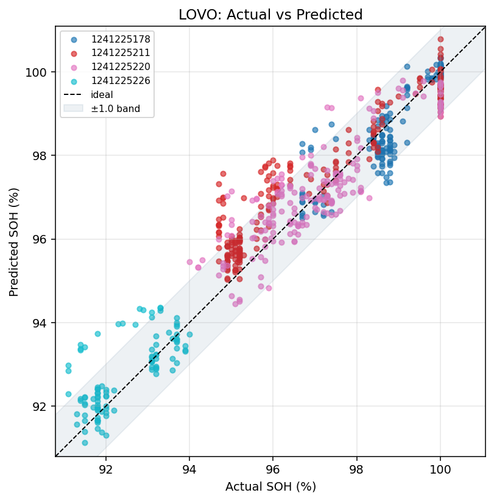

# ev_soh_prediction — PatchTST SOH 예측

`./data`의 EV BMS CSV로 **일 단위 다변량 궤적**을 만든 뒤, PatchTST로 **H일 후 SOH**를 예측하는 프로젝트입니다.

---

## 데이터

원본은 차량별 BMS 로그 CSV입니다. 구분자는 쉼표(`,`), 컬럼 수는 전 차량 동일합니다.

| 항목 | 값 |
|------|-----|
| 차량 수 | 4대 |
| 컬럼 수 | **67** (전 파일 동일) |
| 원본 총 행 수 | **약 594.8만** (헤더 제외) |
| 원본 기간 | 2022-12-15 ~ 2023-08-31 |
| 일별 궤적 | 735행 (`outputs/daily/traj/trajectories.csv`) |
| 학습 타깃 | `soh` (일별 median) |
| 원본 CSV | **git 미포함** — `data/`에 로컬로 두고 사용 (`data/README.md` 참고) |

### 차량별 요약

| device | 파일 | 컬럼 | 원본 행 수 | 일수 | 기간 | SOH 시작→끝 | SOH min~max | 하락 | odometer 시작→끝 |
|--------|------|------|------------|------|------|-------------|-------------|------|------------------|
| 1241225178 | `01241225178.csv` | 67 | 1,350,196 | 164 | 2023-01-11 ~ 2023-06-30 | 100.0 → 97.4 | 96.7 ~ 100.0 | 2.6%p | 23,221 → 41,337 |
| 1241225211 | `01241225211.csv` | 67 | 2,289,088 | 242 | 2022-12-20 ~ 2023-08-31 | 100.0 → 95.8 | 94.7 ~ 100.0 | 4.2%p | 71,121 → 123,134 |
| 1241225220 | `01241225220.csv` | 67 | 2,098,412 | 208 | 2022-12-19 ~ 2023-08-31 | 100.0 → 96.8 | 94.0 ~ 100.0 | 3.2%p | 17,032 → 81,945 |
| 1241225226 | `01241225226.csv` | 67 | 210,510 | 121 | 2022-12-15 ~ 2023-08-31 | 91.8 → 91.7 | 91.1 ~ 94.0 | 0.1%p | 14,729 → 29,982 |

- **SOH 시작/끝**: 일별 궤적에서 첫날·마지막날 median SOH  
- **하락**: 시작 − 끝 (양수면 기간 중 저하)  
- `1241225226`은 시작 SOH가 이미 ~92라 하락폭은 작지만, 절대 수준이 가장 낮음

---

## 실험 방식 (outputs 분리)

| `--exp` | 설명 | 상태 | 산출 경로 |
|---------|------|------|-----------|
| `daily` | 일별 압축 궤적 | **구현됨** | `outputs/daily/` |
| `session` | 일별 압축 없이 세션/고해상도 | 준비 중 | `outputs/session/` |
| `by_chg_mode` | 충전 방식(slow/fast) 분리 학습 | 준비 중 | `outputs/by_chg_mode/` |

각 실험 폴더 아래는 동일하게 `traj/`, `models/`, `figs/` 를 둡니다.

## 전체 흐름 (daily)

```
data/*.csv
    │
    ▼  python scripts/run.py prepare --exp daily
outputs/daily/traj/trajectories.csv
    │
    ▼  python scripts/run.py train --exp daily
    ├─ 슬라이딩 윈도우 (L → H일 후 SOH)
    ├─ LOVO 검증
    └─ outputs/daily/models/*.pt
    │
    ▼  python scripts/run.py plot --exp daily
outputs/daily/figs/*.png
```

---

## 학습에 사용된 컬럼

원본 67개 컬럼 중 **아래 17개 채널**만 PatchTST 입력으로 씁니다.  
타깃은 **`soh`(H일 뒤)** 이고, 학습 시에는 ΔSOH = SOH(t+H) − SOH(t) 로 변환합니다.  
`cell_volt_mean`은 원본 `cell_volt_list`를 평균한 **파생 컬럼**입니다.  
`chg_mode`는 `slow=0`, `fast=1`로 인코딩한 뒤 **일별 평균(=급속 비율, 0~1)** 으로 넣습니다.

| # | 컬럼 | 일별 집계 | 역할 |
|---|------|-----------|------|
| 1 | `soh` | median | 입력 문맥 + 타깃의 기준(last) |
| 2 | `odometer` | max | 누적 주행거리 |
| 3 | `chg_mode` | mean (0/1) | 충전 모드 (slow/fast → 급속 비율) |
| 4 | `chrg_cnt` | max | 누적 충전 횟수 |
| 5 | `chrg_cnt_q` | max | 분기/구간 충전 횟수 |
| 6 | `cumul_current_dischrgd` | max | 누적 방전 전류(Ah) |
| 7 | `cumul_pw_chrgd` | max | 누적 충전 전력 |
| 8 | `cumul_energy_chrgd_q` | max | 분기/구간 누적 충전 에너지 |
| 9 | `op_time` | max | 누적 동작 시간 |
| 10 | `mod_min_temp` | mean | 모듈 최저 온도 |
| 11 | `mod_max_temp` | mean | 모듈 최고 온도 |
| 12 | `batt_coolant_inlet_temp` | mean | 냉각수 입구 온도 |
| 13 | `ext_temp` | mean | 외기 온도 |
| 14 | `pack_current` | mean | 팩 전류 |
| 15 | `pack_volt` | mean | 팩 전압 |
| 16 | `acceptable_chrg_pw` | mean | 허용 충전 전력 |
| 17 | `cell_volt_mean` | mean | 셀 전압 평균 (`cell_volt_list`→평균) |

키/정렬용(모델 입력 아님): `device_no`, `date` (또는 `msg_time`)

코드상 정의: `src/config.py` 의 `FEATURES` 리스트.

---

## 디렉터리 구조

```
ev_soh_prediction/
  data/                      # 원본 CSV (git 제외)
  scripts/
    run.py                   # 통합 CLI: prepare | train | plot | all
  src/
    config.py                # FEATURES, 실험 경로
    data_prep.py             # 궤적 생성 (daily / session / by_chg_mode)
    train_lib.py             # 윈도우·학습·LOVO
    plot_lib.py              # 예측 그래프
    patchtst.py              # 모델
  outputs/
    daily/                   # ★ 현재 결과
      traj/trajectories.csv
      models/
      figs/
    session/                 # 예정 (압축 없음)
    by_chg_mode/             # 예정 (slow/fast)
  docs/figs/                 # README용 그림 복사
  requirements.txt
  README.md
```

---

## 코드 동작

### 1. `src/data_prep.py` (+ `run.py prepare`) — 초단위 → 일단위

**하는 일:** 같은 날의 초단위 행을 하루 1줄로 압축한다.

**입력** `data/01241225178.csv` (같은 날 수천 행)

| device_no | msg_time | soh | odometer | cell_volt_list | … |
|-----------|----------|-----|----------|----------------|---|
| 1241225178 | 2023-01-11 20:54:29 | 100 | 23221 | `3.88,3.88,…` | … |
| 1241225178 | 2023-01-11 20:54:31 | 100 | 23221 | `3.88,3.90,…` | … |
| … | … (하루 동안 ~5천 행) | … | … | … | … |

**집계 규칙**

| 방식 | 컬럼 | 예시 의미 |
|------|------|-----------|
| median | `soh` | 그날 SOH 대표값 |
| max | `odometer`, `chrg_cnt`, `cumul_*`, `op_time` | 누적값은 하루 끝 값 |
| mean | 온도·전류·`cell_volt_mean` | 그날 평균 |
| count | `n_rows` | 원본이 몇 행이었는지 |

**출력** `outputs/daily/traj/trajectories.csv` (하루 1행)

| device_no | date | soh | cell_volt_mean | n_rows | odometer | … |
|-----------|------|-----|----------------|--------|----------|---|
| 1241225178 | 2023-01-11 | 100.0 | 4.044 | 5276 | 23221 | … |
| 1241225178 | 2023-01-12 | 100.0 | 3.803 | 4346 | 23308 | … |
| 1241225178 | 2023-01-13 | 100.0 | 3.947 | 10076 | 23420 | … |

→ 4대 차량 × 기간 ≈ **735행**짜리 “일별 시계열”이 된다.

---

### 2. `src/patchtst.py` — 모델 한 번 forward

**하는 일:** “과거 L일 표”를 넣으면 “SOH가 얼마나 변할지(Δ)” 숫자 1개를 낸다.

기본값 `L=14`, 채널 `F=12` 일 때:

```
입력 X  shape = (B, 14, 17)
         B = 배치(한 번에 넣는 윈도우 개수)
         14 = 과거 14일
         17 = [soh, odometer, chg_mode, …, cell_volt_mean]

출력 y  shape = (B,)
         각 윈도우마다 ΔSOH 하나  (예: -0.3 이면 “7일 뒤 0.3%p 감소” 예측)
```

**작은 숫자 예시** (`B=1`, 설명용으로 L=3만 가정)

```
입력 (1, 3, 17) — 과거 3일 × 17채널 (설명용으로 L=3)
        day-2   day-1   day0(오늘)
soh      100.0   100.0    99.8
odo    23200   23300   23400
…         …       …       …
cell_v    3.90    3.88    3.87

모델 내부: 채널마다 시계열을 patch로 자름 → Transformer → Linear
출력: ΔSOH = -0.2

추론 시 최종 SOH = 오늘 soh + Δ = 99.8 + (-0.2) = 99.6
```

실제 학습/추론에서는 **L=14, H=7** (오늘 기준 7일 뒤 SOH).

---

### 3. `src/train_lib.py` (+ `run.py train`) — 윈도우 만들고 학습·검증

**하는 일:** 일별 궤적에서 슬라이딩 윈도우를 뽑고, PatchTST를 학습한 뒤 LOVO로 평가한다.

#### 3-1. 슬라이딩 윈도우 (L=14, H=7)

한 차량의 날짜가 `D1, D2, …, D30` 이라고 하면:

```
윈도우 #1
  입력: D1~D14 의 17채널 표   →  shape (14, 17)
  last: D14의 soh              →  예: 99.5
  정답: D21의 soh              →  예: 99.2   (H=7일 뒤)
  학습 타깃 Δ: 99.2 - 99.5 = -0.3

윈도우 #2
  입력: D2~D15
  last: D15 soh
  정답: D22 soh
  …

→ 4대 합쳐 윈도우 약 655개, X shape = (655, 14, 17)
```

#### 3-2. LOVO 검증 예시

```
Fold: test = 차량 A,  train = 차량 B·C·D
  → A의 각 윈도우에 대해 예측 SOH = last + 모델(Δ)
  → Acc@±1.0 = (|예측-실제| ≤ 1.0 인 비율)

hold-last 베이스라인: 예측 = last  (Δ=0, “7일 뒤에도 그대로”)
```

#### 3-3. 최종 저장

| 파일 | 내용 |
|------|------|
| `ev_L14_H7_patchtst.pt` | 학습된 가중치 |
| `ev_L14_H7_patchtst.json` | 피처 목록 + 표준화용 mean/std (`mus`, `sds`, `mu_t`, `sd_t`) |

추론 시: 새 윈도우 X를 `(X - mus) / sds` 로 맞춘 뒤 모델 → Δ → `last + Δ` = 예측 SOH.

---

## 실행 방법

```bash
cd ev_soh_prediction
pip install -r requirements.txt

# daily 실험 (기본)
python scripts/run.py prepare --exp daily
python scripts/run.py train   --exp daily
python scripts/run.py plot    --exp daily

# 한 번에
python scripts/run.py all --exp daily

# 옵션 예
python scripts/run.py train --exp daily --L 21 --H 14 --epochs 80 --holdout-device 1241225226
python scripts/run.py train --exp daily --skip-lovo
```

### 주요 하이퍼파라미터 (기본값)

| 항목 | 값 | 의미 |
|------|-----|------|
| `L` | 14 | lookback (일) |
| `H` | 7 | 예측 지평 (일) |
| `epochs` | 60 | 학습 epoch |
| `lr` | 1e-3 | AdamW 학습률 |
| `patch_len` / `stride` | 4 / 2 | 패치 크기 |
| `d_model` / `n_heads` / `n_layers` | 64 / 4 / 2 | Transformer |

---

## 평가 지표

SOH는 연속값이므로 분류 accuracy 대신 **허용오차 정확도**를 씁니다.

| 지표 | 의미 |
|------|------|
| **Acc@±0.5** | \|예측 − 실제\| ≤ 0.5%p 인 비율 |
| **Acc@±1.0** | \|예측 − 실제\| ≤ 1.0%p 인 비율 (주 지표) |
| **Acc@±2.0** | \|예측 − 실제\| ≤ 2.0%p 인 비율 |
| MAE | 평균 절대오차 (참고) |

베이스라인 **hold-last** = “7일 뒤에도 지금 SOH 그대로” 가정.  
`Acc@±1.0 margin = model − hold-last` → **양수면** 모델이 이김.

---

## 실행 결과 (2026-07-21)

### 데이터

| 항목 | 값 |
|------|-----|
| 원본 차량 | 4대 (`1241225178`, `…211`, `…220`, `…226`) |
| 기간 | 2022-12-15 ~ 2023-08-31 |
| 일별 궤적 | **735행** |
| 윈도우 (L=14, H=7) | **655개**, shape `(655, 14, 17)` |
| 학습 디바이스 | CUDA |

차량별 SOH 요약 (일별 median):

| device | min | mean | max | 일수 |
|--------|-----|------|-----|------|
| 1241225178 | 96.7 | 98.9 | 100.0 | 164 |
| 1241225211 | 94.7 | 97.3 | 100.0 | 242 |
| 1241225220 | 94.0 | 97.3 | 100.0 | 208 |
| 1241225226 | 91.1 | 92.5 | 94.0 | 121 |

### LOVO 검증 (차량 1대 제외 교차)

| test device | n | Acc@±0.5 | Acc@±1.0 | Acc@±2.0 | hold-last Acc@±1.0 | Acc@±1.0 margin |
|-------------|---|----------|----------|----------|--------------------|-----------------|
| 1241225178 | 144 | 70.1% | 91.7% | 100% | 95.8% | −4.2%p ✗ |
| 1241225211 | 222 | 44.1% | 79.7% | 97.3% | 98.6% | −18.9%p ✗ |
| 1241225220 | 188 | 49.5% | 83.5% | 98.9% | 89.9% | −6.4%p ✗ |
| 1241225226 | 101 | 63.4% | 83.2% | 99.0% | 93.1% | −9.9%p ✗ |
| **평균** | — | **56.8%** | **84.5%** | **98.8%** | **94.4%** | **−9.9%p** |

해석:
- **±2.0%p 안**이면 거의 전부 맞음 (평균 Acc@±2.0 ≈ 99%)
- **±1.0%p** 기준으로는 약 **84.5%** 정확 — 다만 hold-last(94.4%)보다 낮음
- 7일 뒤 SOH가 거의 안 바뀌어서 “직전 값 유지”가 강한 베이스라인
- 피처를 17채널로 늘린 뒤에도 LOVO는 hold-last를 넘지 못함 (차량 수·단기 지평 한계)

상세: `outputs/daily/models/lovo_metrics.csv`

### 예측 그래프 (LOVO)

재생: `python scripts/run.py plot --exp daily`

#### 1) 차량별 시계열 — 실제 vs PatchTST vs hold-last


#### 2) 실제 vs 예측 산점도 (±1.0%p 밴드)



#### 3) 오차 분포 · 허용오차 정확도


### 최종 모델 (전체 차량 학습)

| 항목 | Acc@±0.5 | Acc@±1.0 | Acc@±2.0 | MAE |
|------|----------|----------|----------|-----|
| **model (train)** | **94.0%** | **99.4%** | **100%** | 0.182 |
| hold-last (train) | 78.3% | 94.7% | 100% | 0.333 |

| 저장 | 경로 |
|------|------|
| 가중치 | `outputs/daily/models/ev_L14_H7_patchtst.pt` |
| 메타 | `outputs/daily/models/ev_L14_H7_patchtst.json` |

학습 세트에서는 Acc@±1.0 **99.4%**로 hold-last(94.7%)를 이깁니다.  
일반화(LOVO)는 아직 베이스라인을 넘지 못했습니다.

---

## 산출물 요약

| 경로 | 내용 |
|------|------|
| `outputs/daily/traj/trajectories.csv` | 일별 집계 궤적 |
| `outputs/daily/models/ev_L{L}_H{H}_patchtst.pt` | 모델 가중치 |
| `outputs/daily/models/ev_L{L}_H{H}_patchtst.json` | 피처 목록·표준화 통계·모델 설정 |
| `outputs/daily/models/lovo_metrics.csv` | LOVO Acc@±tol / MAE / margin |
| `outputs/daily/figs/lovo_pred_*.png` | LOVO 예측 그래프 |
| `outputs/daily/figs/lovo_predictions.csv` | LOVO 시점별 예측값 |

---

## 개선 여지

- 차량 수 확대 또는 더 긴 지평 (`--H 14`, `--L 21`)
- 월 단위 궤적·다중 horizon 학습
- hold-last를 이기는 설정만 배포하는 게이트 (기존 BMS_PatchTST 레퍼런스와 동일 패턴)
