# ev_soh_prediction — PatchTST SOH 예측

`./data`의 EV BMS CSV로 궤적을 만든 뒤, PatchTST로 **H 스텝 후 SOH**를 예측하는 프로젝트입니다.

실행 파일은 **일별 압축**과 **로우(비압축)** 두 갈래로 나뉩니다.

| 트랙 | CLI | 궤적 | 타임스텝 의미 |
|------|-----|------|----------------|
| **일별 압축** | `scripts/run_daily.py` | `outputs/daily/`, `outputs/by_chg_mode/` | 1 스텝 ≈ 1일 |
| **로우(비압축)** | `scripts/run_raw.py` | `outputs/raw/` | 1 스텝 ≈ 샘플링된 원본 행 |

### 개념 그림

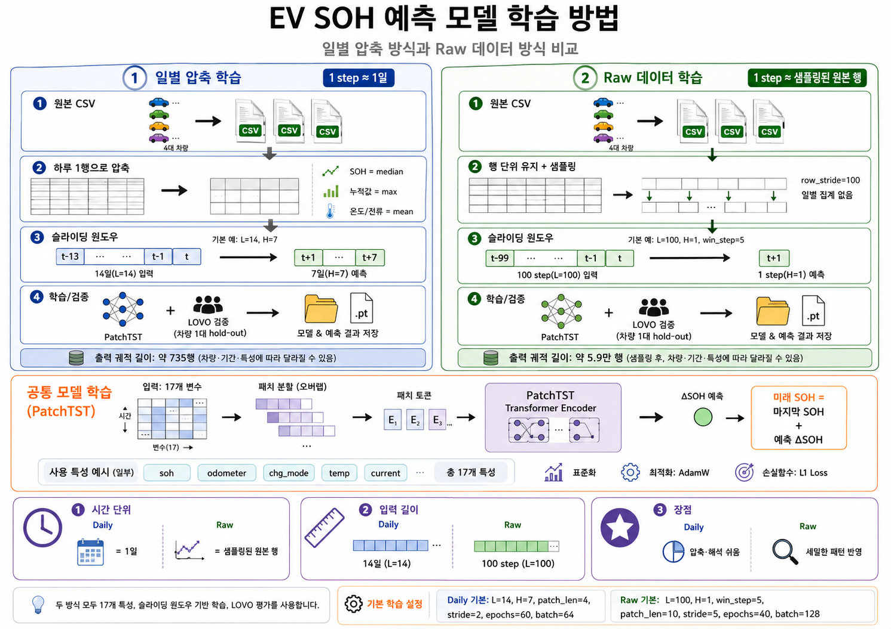

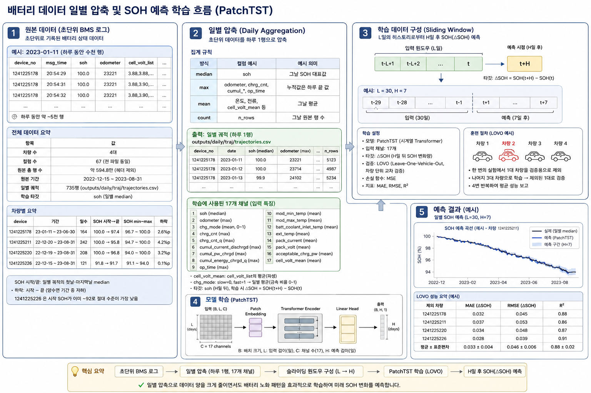

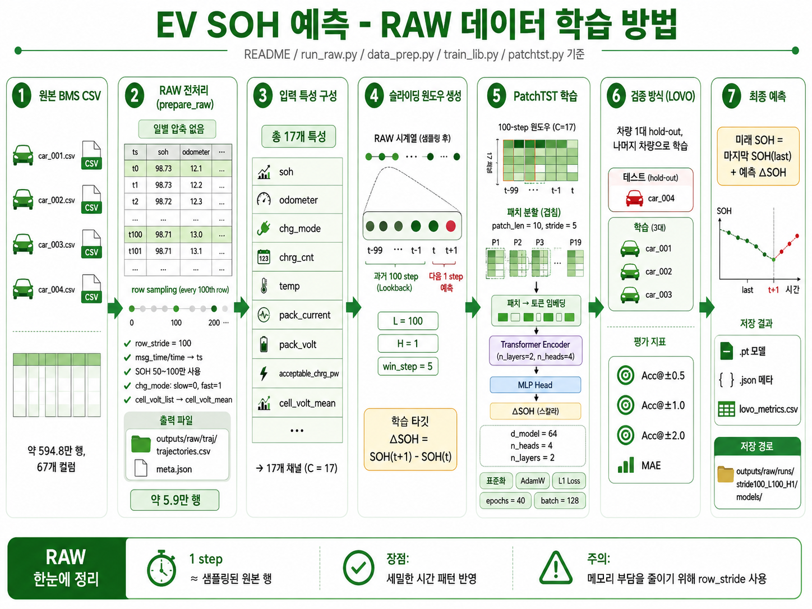

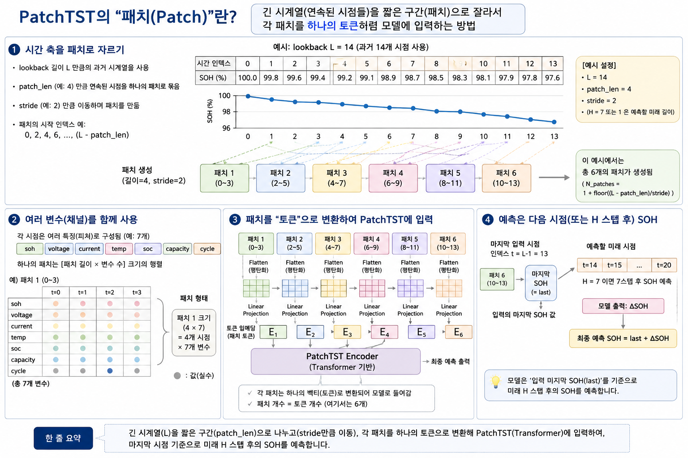

---

## 데이터

원본은 차량별 BMS 로그 CSV입니다. 구분자는 쉼표(`,`), 컬럼 수는 전 차량 동일합니다.

| 항목 | 값 |
|------|-----|
| 차량 수 | 4대 |
| 컬럼 수 | **67** (전 파일 동일) |
| 원본 총 행 수 | **약 594.8만** (헤더 제외) |
| 원본 기간 | 2022-12-15 ~ 2023-08-31 |
| 일별 궤적 | 735행 (`outputs/daily/traj/trajectories.csv`) |
| 로우 궤적 | `row_stride=100` 샘플 → 약 5.9만행 (`outputs/raw/traj/trajectories.csv`) |
| 학습 타깃 | `soh` |
| 원본 CSV | **git 미포함** — `data/`에 로컬로 두고 사용 (`data/README.md` 참고) |

### 차량별 요약

| device | 파일 | 컬럼 | 원본 행 수 | 일수 | 기간 | SOH 시작→끝 | SOH min~max | 하락 | odometer 시작→끝 |
|--------|------|------|------------|------|------|-------------|-------------|------|------------------|
| 1241225178 | `01241225178.csv` | 67 | 1,350,196 | 164 | 2023-01-11 ~ 2023-06-30 | 100.0 → 97.4 | 96.7 ~ 100.0 | 2.6%p | 23,221 → 41,337 |
| 1241225211 | `01241225211.csv` | 67 | 2,289,088 | 242 | 2022-12-20 ~ 2023-08-31 | 100.0 → 95.8 | 94.7 ~ 100.0 | 4.2%p | 71,121 → 123,134 |
| 1241225220 | `01241225220.csv` | 67 | 2,098,412 | 208 | 2022-12-19 ~ 2023-08-31 | 100.0 → 96.8 | 94.0 ~ 100.0 | 3.2%p | 17,032 → 81,945 |
| 1241225226 | `01241225226.csv` | 67 | 210,510 | 121 | 2022-12-15 ~ 2023-08-31 | 91.8 → 91.7 | 91.1 ~ 94.0 | 0.1%p | 14,729 → 29,982 |

- **SOH 시작/끝**: 일별 궤적에서 첫날·마지막날 median SOH  
- **하락**: 시작 − 끝 (양수면 기간 중 저하)  
- `1241225226`은 시작 SOH가 이미 ~92라 하락폭은 작지만, 절대 수준이 가장 낮음

---

## 실험 방식 (outputs · CLI 분리)

| 트랙 | CLI | `--exp` / 고정 | 설명 | 산출 경로 |
|------|-----|----------------|------|-----------|
| 일별 압축 | `run_daily.py` | `daily` | 하루 1행으로 압축 | `outputs/daily/` |
| 일별 압축 | `run_daily.py` | `by_chg_mode` | 급속/완속 분리 후 일별 압축 | `outputs/by_chg_mode/{slow,fast}/` |
| 로우 | `run_raw.py` | (고정 `raw`) | 일별 압축 없음, 행 샘플링 | `outputs/raw/` |

각 실험 폴더 아래는 `traj/`, `runs/.../{models,figs}/` 구조입니다.  
daily·by_chg_mode: `runs/L{L}_H{H}/` · raw: `runs/stride{S}_L{L}_H{H}/` (`S` = `prepare`의 `row_stride`).

### 전체 흐름 — 일별 압축 (`run_daily.py`)

```
data/*.csv
    │
    ▼  python scripts/run_daily.py prepare --exp daily
outputs/daily/traj/trajectories.csv   # 하루 1행
    │
    ▼  python scripts/run_daily.py train --exp daily --L 30 --H 7
    ├─ 슬라이딩 윈도우 (L일 → H일 후 SOH)
    ├─ LOVO 검증
    └─ outputs/daily/runs/L30_H7/models/
    │
    ▼  python scripts/run_daily.py plot --exp daily --L 30 --H 7
outputs/daily/runs/L30_H7/figs/
```

### 전체 흐름 — 로우 비압축 (`run_raw.py`)

```
data/*.csv
    │
    ▼  python scripts/run_raw.py prepare --row-stride 100
outputs/raw/traj/trajectories.csv     # 일별 집계 없음 (행 샘플)
outputs/raw/traj/meta.json              # row_stride 기록
    │
    ▼  python scripts/run_raw.py train --L 100 --H 1 --row-stride 100
    ├─ 슬라이딩 윈도우 (과거 100스텝 → 바로 다음 SOH)
    ├─ LOVO 검증
    └─ outputs/raw/runs/stride100_L100_H1/models/
    │
    ▼  python scripts/run_raw.py plot --L 100 --H 1 --row-stride 100
outputs/raw/runs/stride100_L100_H1/figs/
```

> 원본 ~600만 행을 그대로 쓰면 윈도우·메모리가 과도해져, prepare 시 `--row-stride`(기본 100)로 청크 안 행을 샘플링합니다.

---

## 학습에 사용된 컬럼

원본 67개 컬럼 중 **아래 17개 채널**만 PatchTST 입력으로 씁니다.  
타깃은 **`soh`(H 스텝 뒤)** 이고, 학습 시에는 ΔSOH = SOH(t+H) − SOH(t) 로 변환합니다.  
`cell_volt_mean`은 원본 `cell_volt_list`를 평균한 **파생 컬럼**입니다.  
`chg_mode`는 `slow=0`, `fast=1`로 인코딩합니다 (daily에서는 일별 평균=급속 비율).

| # | 컬럼 | daily 집계 | raw | 역할 |
|---|------|------------|-----|------|
| 1 | `soh` | median | 행 값 | 입력 문맥 + 타깃 기준(last) |
| 2 | `odometer` | max | 행 값 | 누적 주행거리 |
| 3 | `chg_mode` | mean (0/1) | 0/1 | 충전 모드 |
| 4 | `chrg_cnt` | max | 행 값 | 누적 충전 횟수 |
| 5 | `chrg_cnt_q` | max | 행 값 | 분기/구간 충전 횟수 |
| 6 | `cumul_current_dischrgd` | max | 행 값 | 누적 방전 전류(Ah) |
| 7 | `cumul_pw_chrgd` | max | 행 값 | 누적 충전 전력 |
| 8 | `cumul_energy_chrgd_q` | max | 행 값 | 분기/구간 누적 충전 에너지 |
| 9 | `op_time` | max | 행 값 | 누적 동작 시간 |
| 10 | `mod_min_temp` | mean | 행 값 | 모듈 최저 온도 |
| 11 | `mod_max_temp` | mean | 행 값 | 모듈 최고 온도 |
| 12 | `batt_coolant_inlet_temp` | mean | 행 값 | 냉각수 입구 온도 |
| 13 | `ext_temp` | mean | 행 값 | 외기 온도 |
| 14 | `pack_current` | mean | 행 값 | 팩 전류 |
| 15 | `pack_volt` | mean | 행 값 | 팩 전압 |
| 16 | `acceptable_chrg_pw` | mean | 행 값 | 허용 충전 전력 |
| 17 | `cell_volt_mean` | mean | 행 평균 | 셀 전압 평균 |

키/정렬용(모델 입력 아님): `device_no`, `date`(daily) 또는 `ts`(raw)

코드상 정의: `src/config.py` 의 `FEATURES` 리스트.

---

## 디렉터리 구조

```
ev_soh_prediction/
  data/                         # 원본 CSV (git 제외)
  img/                          # 학습·패치 개념 그림
  scripts/
    run_daily.py                # 일별 압축 CLI (daily / by_chg_mode)
    run_raw.py                  # 로우 비압축 CLI
  src/
    config.py                   # FEATURES, 실험 경로
    data_prep.py                # prepare_daily / prepare_by_chg_mode / prepare_raw
    train_lib.py                # 윈도우·학습·LOVO
    plot_lib.py                 # 예측 그래프
    patchtst.py                 # 모델
  outputs/
    daily/                      # 일별 압축
      traj/trajectories.csv
      runs/L14_H7|L30_H1|L30_H7/{models,figs}/
    by_chg_mode/                # 일별 압축 + 모드 분리
      slow|fast/
        traj/trajectories.csv
        runs/L30_H7/{models,figs}/
    raw/                        # 일별 압축 없음
      traj/trajectories.csv
      runs/stride{S}_L{L}_H{H}/{models,figs}/   # S=row_stride
  requirements.txt
  README.md
```

---

## 코드 동작

### 1a. 일별 압축 — `data_prep.prepare_daily` (+ `run_daily.py prepare`)

**하는 일:** 같은 날의 초단위 행을 하루 1줄로 압축한다.

**입력** `data/01241225178.csv` (같은 날 수천 행)

| device_no | msg_time | soh | odometer | cell_volt_list | … |
|-----------|----------|-----|----------|----------------|---|
| 1241225178 | 2023-01-11 20:54:29 | 100 | 23221 | `3.88,3.88,…` | … |
| … | … (하루 동안 ~5천 행) | … | … | … | … |

**집계 규칙**

| 방식 | 컬럼 |
|------|------|
| median | `soh` |
| max | `odometer`, `chrg_cnt`, `cumul_*`, `op_time` |
| mean | 온도·전류·`cell_volt_mean`, `chg_mode` |
| count | `n_rows` |

**출력** `outputs/daily/traj/trajectories.csv` (하루 1행, ≈735행)

### 1b. 로우 비압축 — `data_prep.prepare_raw` (+ `run_raw.py prepare`)

**하는 일:** 일별 집계 없이 행 단위로 17채널을 정리한다.  
청크 안에서 `--row-stride`(기본 100)마다 한 행만 남긴다.

**출력** `outputs/raw/traj/trajectories.csv` (`device_no`, `ts`, FEATURES…)

| device_no | ts | soh | odometer | chg_mode | … |
|-----------|-----|-----|----------|----------|---|
| 1241225178 | 2023-01-11 20:54:29 | 100.0 | 23221 | 0 | … |
| 1241225178 | 2023-01-11 21:01:… | 100.0 | 23225 | 1 | … |

### 2. `src/patchtst.py` — 모델 forward

과거 L 스텝 × 17채널 → ΔSOH 하나.

```
입력 X  shape = (B, L, 17)
출력 y  shape = (B,)   # ΔSOH
추론 SOH = last + Δ
```

- daily 기본 예: `L=14` (14일)
- raw 기본 예: `L=100` (샘플 100스텝), `patch_len=10`, `stride=5`

### 3. `src/train_lib.py` — 윈도우 · 학습 · LOVO

슬라이딩 윈도우: 입력 `t-L+1 … t`, 정답 `t+H`의 soh, 학습 타깃 `Δ = soh(t+H) − soh(t)`.

- daily R1 예: L=14, H=7 → “7일 후”
- raw R5 예: L=100, H=1 → “바로 다음 샘플”

`--win-step` > 1 이면 윈도우를 듬성히 뽑아 개수를 줄일 수 있습니다 (주로 raw).

LOVO: 차량 1대 hold-out, 나머지 학습. hold-last = “H 스텝 뒤에도 지금 SOH”.

---

## 실행 방법

`prepare` → `train` → `plot`을 나눠 돌리거나, **`all`로 한 번에** 실행할 수 있습니다.  
궤적(`traj`)이 이미 있으면 `train` / `plot`만 해도 됩니다.

```bash
cd ev_soh_prediction
pip install -r requirements.txt

# ── 일별 압축 (run_daily.py) — 한 번에 ──
python scripts/run_daily.py all --exp daily --L 14 --H 7
python scripts/run_daily.py all --exp daily --L 30 --H 1
python scripts/run_daily.py all --exp daily --L 30 --H 7
python scripts/run_daily.py all --exp by_chg_mode --mode all --L 30 --H 7

# ── 로우 비압축 (run_raw.py) — 한 번에 ──
python scripts/run_raw.py all --L 100 --H 1 --win-step 5 --row-stride 100

# ── 단계별 (참고) ──
# python scripts/run_daily.py prepare --exp daily
# python scripts/run_daily.py train   --exp daily --L 14 --H 7
# python scripts/run_daily.py plot    --exp daily --L 14 --H 7
#
# python scripts/run_raw.py prepare --row-stride 100
# python scripts/run_raw.py train   --L 100 --H 1 --win-step 5
# python scripts/run_raw.py plot    --L 100 --H 1 --win-step 5
```

### 주요 하이퍼파라미터

| 항목 | daily 기본 | raw 기본 | 의미 |
|------|------------|----------|------|
| `L` | 14 | 100 | lookback 스텝 |
| `H` | 7 | 1 | 예측 지평 (스텝) |
| `epochs` | 60 | 40 | 학습 epoch |
| `patch_len` / `stride` | 4 / 2 | 10 / 5 | 패치 |
| `row_stride` | — | 100 | prepare 시 행 샘플 간격 |
| `win_step` | 1 | 5 | 윈도우 슬라이드 간격 |
| `mode` | by_chg_mode만 | — | `slow` / `fast` / `all` |
| `--verbose` | off | off | epoch별 train L1 loss 출력 |
| `--log-every` | 10 | 10 | verbose 시 N epoch마다 출력 |

결과는 `outputs/<exp>[/<mode>]/runs/.../` 에 저장됩니다.  
daily·by_chg_mode: `L{L}_H{H}` · raw: `stride{S}_L{L}_H{H}` (`train`/`plot`의 `--row-stride` 생략 시 `traj/meta.json` 사용).
---

## 평가 지표

SOH는 연속값이므로 분류 accuracy 대신 **허용오차 정확도**를 씁니다.

| 지표 | 의미 |
|------|------|
| **Acc@±0.5** | \|예측 − 실제\| ≤ 0.5%p 인 비율 |
| **Acc@±1.0** | \|예측 − 실제\| ≤ 1.0%p 인 비율 (주 지표) |
| **Acc@±2.0** | \|예측 − 실제\| ≤ 2.0%p 인 비율 |
| MAE | 평균 절대오차 (참고) |

베이스라인 **hold-last** = “H일 뒤에도 지금 SOH 그대로” 가정.  
`Acc@±1.0 margin = model − hold-last` → **양수면** 모델이 이김.

---

## 실험 결과

새 설정·방법을 돌릴 때마다 아래 **결과 목록**에 한 줄 추가하고, 상세 섹션을 이어서 붙이면 됩니다.

| ID | 실험 | L | H | 윈도우 수 | LOVO Acc@±1.0 | hold-last Acc@±1.0 | 경로 |
|----|------|---|---|-----------|---------------|--------------------|------|
| R1 | `daily` | 14 | 7 | 655 | 84.5% | 94.4% | [`runs/L14_H7/`](./outputs/daily/runs/L14_H7/) |
| R2 | `daily` | 30 | 1 | 615 | **99.5%** | **99.5%** | [`runs/L30_H1/`](./outputs/daily/runs/L30_H1/) |
| R3 | `daily` | 30 | 7 | 591 | 85.3% | 93.6% | [`runs/L30_H7/`](./outputs/daily/runs/L30_H7/) |
| R4a | `by_chg_mode` · slow | 30 | 7 | 463 | 74.3% | 95.4% | [`slow/runs/L30_H7/`](./outputs/by_chg_mode/slow/runs/L30_H7/) |
| R4b | `by_chg_mode` · fast | 30 | 7 | 296 | 55.4% | 85.6% | [`fast/runs/L30_H7/`](./outputs/by_chg_mode/fast/runs/L30_H7/) |
| R5 | `raw` · H=1 | 100 | 1 | 11819 | **100%** | **100%** | [`runs/stride100_L100_H1/`](./outputs/raw/runs/stride100_L100_H1/) |
| R6 | `raw` · H=50 | 100 | 50 | 11780 | 99.8% | 99.8% | [`runs/stride100_L100_H50/`](./outputs/raw/runs/stride100_L100_H50/) |
| R7 | `raw` · H=180 | 100 | 180 | 11676 | 96.4% | 96.6% | [`runs/stride100_L100_H180/`](./outputs/raw/runs/stride100_L100_H180/) |
| R8 | `raw` · stride 60 | 120 | 180 | 19589 | 98.5% | 99.0% | [`runs/stride60_L120_H180/`](./outputs/raw/runs/stride60_L120_H180/) |
| R9 | `raw` · stride 60 | 120 | 300 | 19493 | 95.9% | 96.6% | [`runs/stride60_L120_H300/`](./outputs/raw/runs/stride60_L120_H300/) |
| R10 | `raw` · stride 30 | 180 | 600 | 39033 | 96.4% | 96.5% | [`runs/stride30_L180_H600/`](./outputs/raw/runs/stride30_L180_H600/) |

공통 데이터: 차량 4대, 기간 2022-12-15 ~ 2023-08-31, CUDA.  
R1–R4는 일별 궤적(735행). R5–R7는 `row_stride=100`, `win_step=5`, `L=100`. R8–R9는 `row_stride=60`, `win_step=5`, `L=120` (궤적 약 9.9만행). R10은 `row_stride=30`, `win_step=5`, `L=180`, `H=600` (궤적 약 19.8만행).

차량별 SOH 요약 (일별 median):

| device | min | mean | max | 일수 |
|--------|-----|------|-----|------|
| 1241225178 | 96.7 | 98.9 | 100.0 | 164 |
| 1241225211 | 94.7 | 97.3 | 100.0 | 242 |
| 1241225220 | 94.0 | 97.3 | 100.0 | 208 |
| 1241225226 | 91.1 | 92.5 | 94.0 | 121 |

---

### R1 — daily · L=14 · H=7 (7일 후 예측)

```bash
# 한 번에 (prepare → train → plot)
python scripts/run_daily.py all --exp daily --L 14 --H 7

# 또는 단계별 (궤적이 이미 있으면 train/plot만)
python scripts/run_daily.py train --exp daily --L 14 --H 7
python scripts/run_daily.py plot  --exp daily --L 14 --H 7
```

#### LOVO

| test device | n | Acc@±0.5 | Acc@±1.0 | Acc@±2.0 | hold-last Acc@±1.0 | Acc@±1.0 margin |
|-------------|---|----------|----------|----------|--------------------|-----------------|
| 1241225178 | 144 | 70.1% | 91.7% | 100% | 95.8% | −4.2%p ✗ |
| 1241225211 | 222 | 44.1% | 79.7% | 97.3% | 98.6% | −18.9%p ✗ |
| 1241225220 | 188 | 49.5% | 83.5% | 98.9% | 89.9% | −6.4%p ✗ |
| 1241225226 | 101 | 63.4% | 83.2% | 99.0% | 93.1% | −9.9%p ✗ |
| **평균** | — | **56.8%** | **84.5%** | **98.8%** | **94.4%** | **−9.9%p** |

- 7일 지평에서는 SOH 변화가 작아 hold-last가 강함
- 상세: `outputs/daily/runs/L14_H7/models/lovo_metrics.csv`

#### 그래프

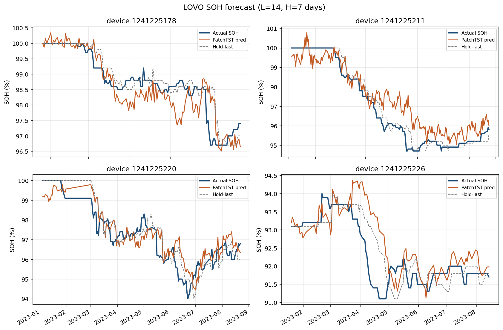


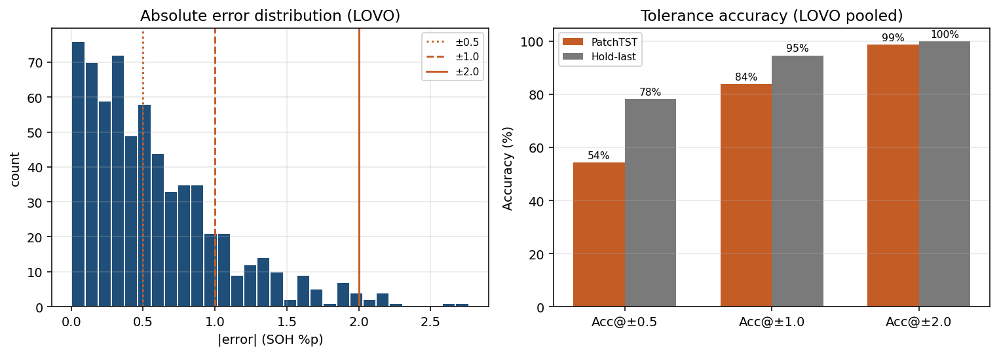

#### 최종 모델 (train)

| 항목 | Acc@±0.5 | Acc@±1.0 | Acc@±2.0 | MAE |
|------|----------|----------|----------|-----|
| model | 94.0% | 99.4% | 100% | 0.182 |
| hold-last | 78.3% | 94.7% | 100% | 0.333 |

저장: `outputs/daily/runs/L14_H7/models/ev_L14_H7_patchtst.{pt,json}`

---

### R2 — daily · L=30 · H=1 (1일 후 예측)

```bash
# 한 번에
python scripts/run_daily.py all --exp daily --L 30 --H 1

# 또는 단계별
python scripts/run_daily.py train --exp daily --L 30 --H 1
python scripts/run_daily.py plot  --exp daily --L 30 --H 1
```

| 항목 | 값 |
|------|-----|
| 윈도우 | **615개**, shape `(615, 30, 17)` |
| 설정 | lookback 30일 → **1일 후** SOH |

#### LOVO

| test device | n | Acc@±0.5 | Acc@±1.0 | Acc@±2.0 | hold-last Acc@±1.0 | Acc@±1.0 margin |
|-------------|---|----------|----------|----------|--------------------|-----------------|
| 1241225178 | 134 | 97.0% | 99.3% | 100% | 99.3% | 0.0%p |
| 1241225211 | 212 | 99.1% | 100% | 100% | 100% | 0.0%p |
| 1241225220 | 178 | 93.3% | 98.9% | 100% | 98.9% | 0.0%p |
| 1241225226 | 91 | 97.8% | 100% | 100% | 100% | 0.0%p |
| **평균** | — | **96.8%** | **99.5%** | **100%** | **99.5%** | **0.0%p** |

- 1일 후 예측은 정확도가 매우 높고, Acc@±1.0은 hold-last와 **동률**(99.5%)
- MAE는 hold-last가 약간 더 작음 (모델 평균 MAE ≈ 0.12 vs hl ≈ 0.09)
- 상세: `outputs/daily/runs/L30_H1/models/lovo_metrics.csv`

#### 그래프

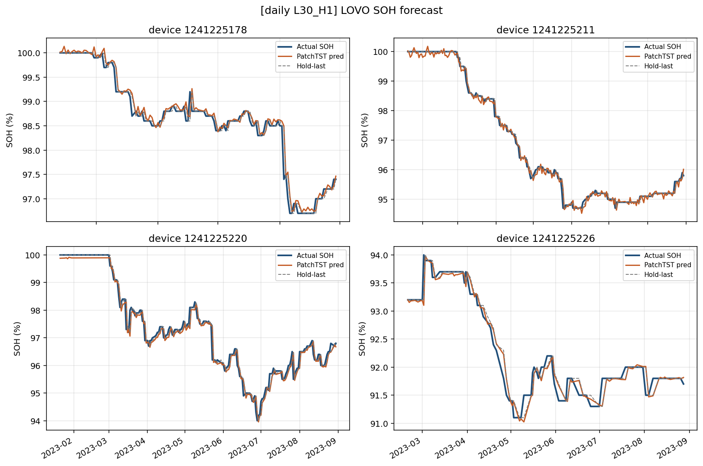

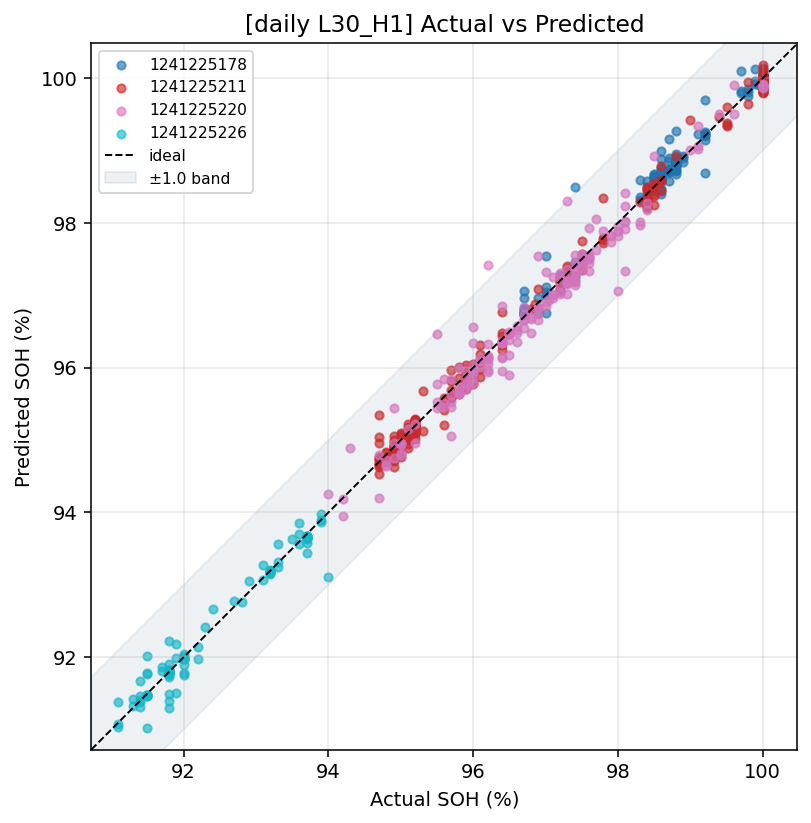

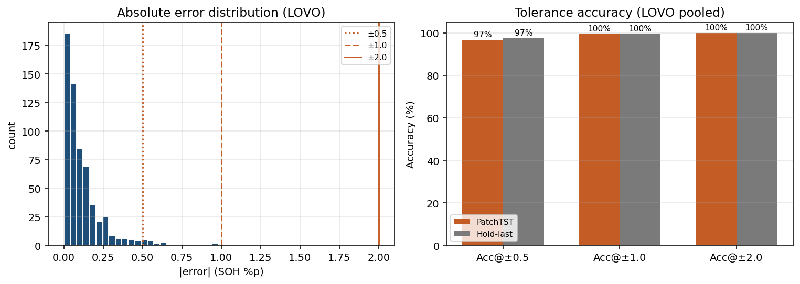

#### 최종 모델 (train)

| 항목 | Acc@±0.5 | Acc@±1.0 | Acc@±2.0 | MAE |
|------|----------|----------|----------|-----|
| model | 97.2% | 99.3% | 100% | 0.088 |
| hold-last | 97.4% | 99.5% | 100% | 0.088 |

저장: `outputs/daily/runs/L30_H1/models/ev_L30_H1_patchtst.{pt,json}`

---

### R3 — daily · L=30 · H=7 (윈도우 30 · 7일 후 예측)

```bash
# 한 번에
python scripts/run_daily.py all --exp daily --L 30 --H 7

# 또는 단계별
python scripts/run_daily.py train --exp daily --L 30 --H 7
python scripts/run_daily.py plot  --exp daily --L 30 --H 7
```

| 항목 | 값 |
|------|-----|
| 윈도우 | **591개**, shape `(591, 30, 17)` |
| 설정 | lookback 30일 → **7일 후** SOH |

#### LOVO

| test device | n | Acc@±0.5 | Acc@±1.0 | Acc@±2.0 | hold-last Acc@±1.0 | Acc@±1.0 margin |
|-------------|---|----------|----------|----------|--------------------|-----------------|
| 1241225178 | 128 | 52.3% | 89.8% | 100% | 95.3% | −5.5%p ✗ |
| 1241225211 | 206 | 82.0% | 97.1% | 100% | 98.5% | −1.5%p ✗ |
| 1241225220 | 172 | 58.1% | 83.7% | 98.3% | 89.0% | −5.2%p ✗ |
| 1241225226 | 85 | 52.9% | 70.6% | 92.9% | 91.8% | −21.2%p ✗ |
| **평균** | — | **61.4%** | **85.3%** | **97.8%** | **93.6%** | **−8.3%p** |

- R1(L14_H7, Acc@±1.0 84.5%)과 비슷한 수준 — **윈도우를 30으로 늘려도 7일 후 예측은 hold-last를 못 이김**
- R2(L30_H1, 99.5%)와 비교하면, 정확도 차이의 주원인은 L보다 **H(예측 지평)** 쪽
- 상세: `outputs/daily/runs/L30_H7/models/lovo_metrics.csv`

#### 그래프

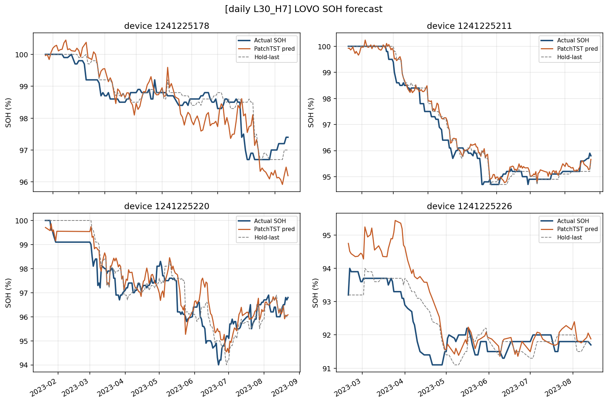

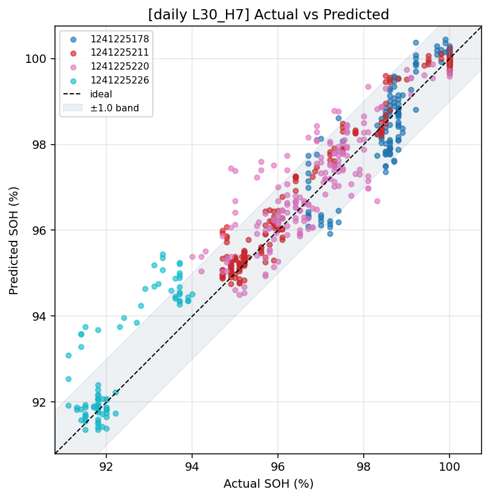

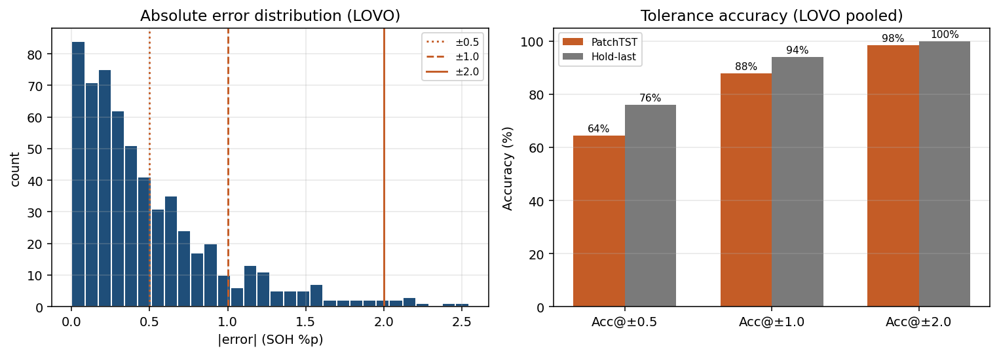

#### 최종 모델 (train)

| 항목 | Acc@±0.5 | Acc@±1.0 | Acc@±2.0 | MAE |
|------|----------|----------|----------|-----|
| model | 93.9% | 99.2% | 100% | 0.219 |
| hold-last | 76.0% | 94.1% | 100% | 0.368 |

저장: `outputs/daily/runs/L30_H7/models/ev_L30_H7_patchtst.{pt,json}`

---

### R4 — by_chg_mode · L=30 · H=7 (완속 / 급속 분리)

원본 `chg_mode`로 행을 나눈 뒤 각각 일별 집계 → 동일 설정(L=30, H=7)으로 학습·LOVO.

```bash
# 한 번에 (slow + fast)
python scripts/run_daily.py all --exp by_chg_mode --mode all --L 30 --H 7

# 또는 단계별
python scripts/run_daily.py prepare --exp by_chg_mode
python scripts/run_daily.py train   --exp by_chg_mode --mode all --L 30 --H 7
python scripts/run_daily.py plot    --exp by_chg_mode --mode all --L 30 --H 7
```

| 모드 | 일수(궤적) | LOVO 가능 차량 | 윈도우 | 비고 |
|------|------------|----------------|--------|------|
| slow | 575 | 3대 (5226은 4일만 → 제외) | 463 | 완속 날만 |
| fast | 425 | 3대 (5178은 21일만 → 제외) | 296 | 급속 날만 |

L+H=37일 미만인 차량은 윈도우가 없어 LOVO에서 빠집니다. 타임스텝은 **해당 모드가 있는 날**만 이어 붙입니다(달력상 빈 날은 스킵).

#### R4a — slow (완속)

| test device | n | Acc@±0.5 | Acc@±1.0 | Acc@±2.0 | hold-last Acc@±1.0 | Acc@±1.0 margin |
|-------------|---|----------|----------|----------|--------------------|-----------------|
| 1241225178 | 128 | 60.2% | 89.1% | 100% | 96.1% | −7.0%p ✗ |
| 1241225211 | 204 | 35.8% | 73.5% | 100% | 98.5% | −25.0%p ✗ |
| 1241225220 | 131 | 22.9% | 60.3% | 96.9% | 91.6% | −31.3%p ✗ |
| **평균** | — | **39.6%** | **74.3%** | **99.0%** | **95.4%** | **−21.1%p** |

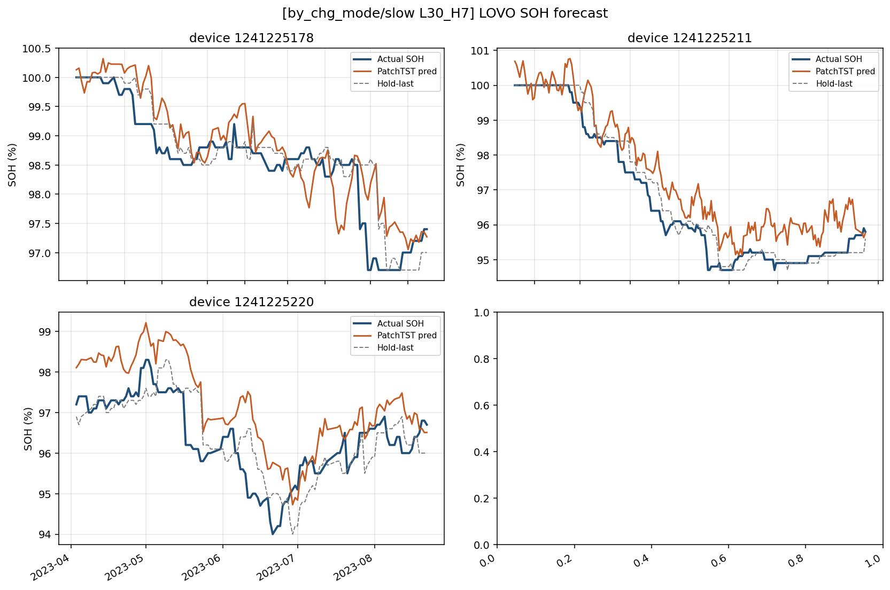

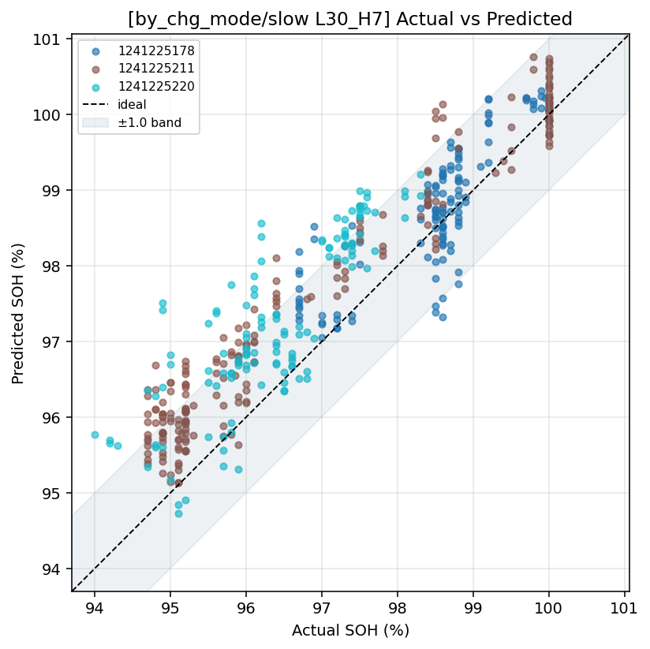

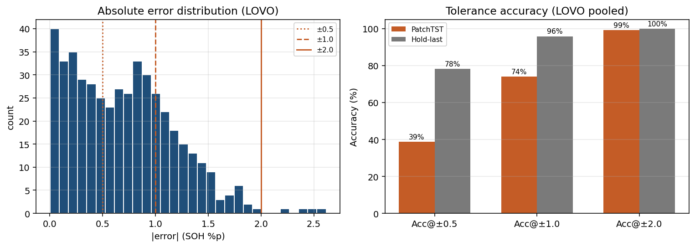

| 항목 (최종 학습) | Acc@±0.5 | Acc@±1.0 | Acc@±2.0 | MAE |
|------------------|----------|----------|----------|-----|
| model | 91.8% | 99.1% | 100% | 0.217 |
| hold-last | 78.2% | 95.9% | 100% | 0.332 |

저장: `outputs/by_chg_mode/slow/runs/L30_H7/models/`

#### R4b — fast (급속)

| test device | n | Acc@±0.5 | Acc@±1.0 | Acc@±2.0 | hold-last Acc@±1.0 | Acc@±1.0 margin |
|-------------|---|----------|----------|----------|--------------------|-----------------|
| 1241225211 | 74 | 6.8% | 23.0% | 60.8% | 82.4% | −59.5%p ✗ |
| 1241225220 | 140 | 38.6% | 66.4% | 97.1% | 82.9% | −16.4%p ✗ |
| 1241225226 | 82 | 46.3% | 76.8% | 100% | 91.5% | −14.6%p ✗ |
| **평균** | — | **30.6%** | **55.4%** | **86.0%** | **85.6%** | **−30.2%p** |

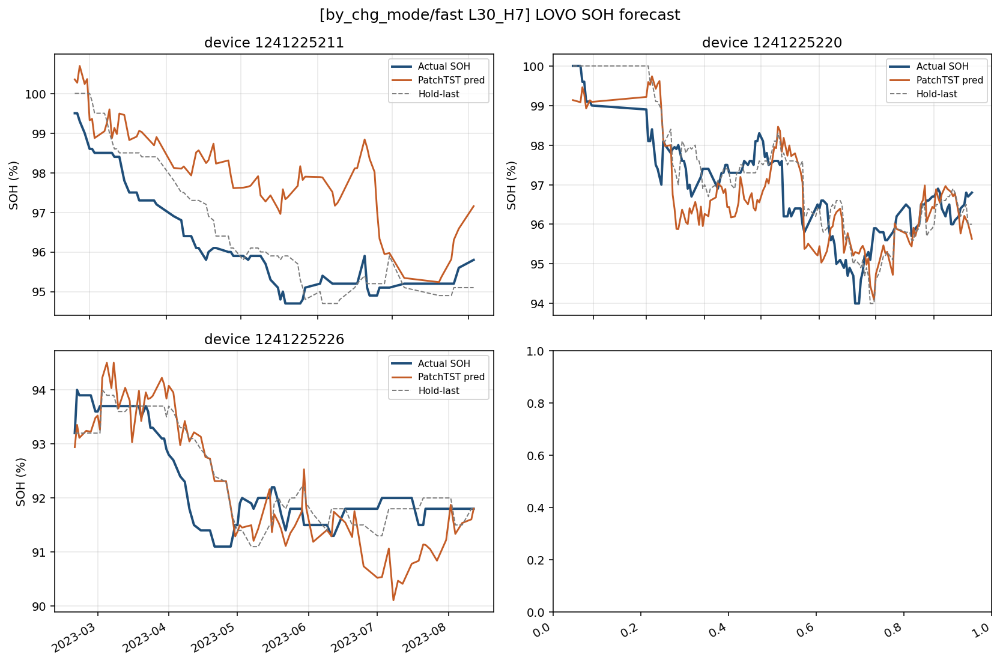

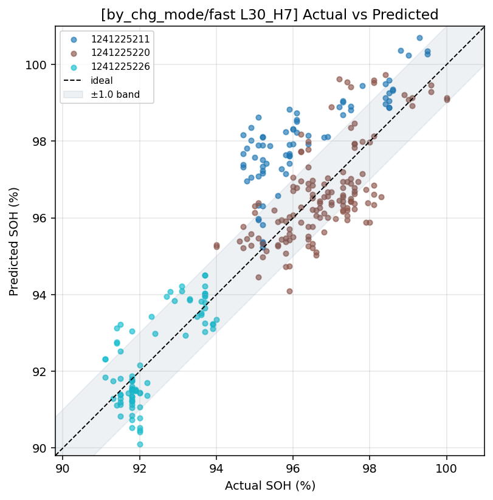

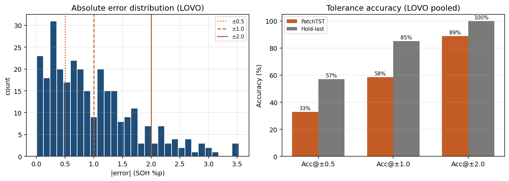

| 항목 (최종 학습) | Acc@±0.5 | Acc@±1.0 | Acc@±2.0 | MAE |
|------------------|----------|----------|----------|-----|
| model | 97.6% | 100% | 100% | 0.195 |
| hold-last | 57.1% | 85.1% | 100% | 0.560 |

저장: `outputs/by_chg_mode/fast/runs/L30_H7/models/`

#### R4 해석

- R3(daily 혼합, Acc@±1.0 **85.3%**)보다 **완속 74.3% · 급속 55.4%**로 둘 다 하락
- 급속이 더 나쁨: 샘플이 적고(296 윈도우), 차량별 급속 사용 편차가 큼
- 분리해도 hold-last를 이기지 못함 — 모드 분리가 7일 지평 성능의 핵심 해법은 아님
- 상세: `outputs/by_chg_mode/{slow,fast}/runs/L30_H7/models/lovo_metrics.csv`

---

### R5 — raw · L=100 · H=1 (일별 압축 없음 · 다음 샘플 예측)

```bash
# 한 번에
python scripts/run_raw.py all --L 100 --H 1 --win-step 5 --row-stride 100

# 또는 단계별
python scripts/run_raw.py prepare --row-stride 100
python scripts/run_raw.py train   --L 100 --H 1 --win-step 5
python scripts/run_raw.py plot    --L 100 --H 1 --win-step 5
```

| 항목 | 값 |
|------|-----|
| 궤적 | **59484행** (`row_stride=100`), shape 윈도우 `(11819, 100, 17)` |
| 설정 | lookback 100스텝 → **바로 다음** 샘플 SOH (`H=1`, `win_step=5`) |
| 패치 | `patch_len=10`, `stride=5` |

#### LOVO

| test device | n | Acc@±0.5 | Acc@±1.0 | Acc@±2.0 | hold-last Acc@±1.0 | Acc@±1.0 margin |
|-------------|---|----------|----------|----------|--------------------|-----------------|
| 1241225178 | 2681 | 100% | 100% | 100% | 100% | 0.0%p |
| 1241225211 | 4559 | 100% | 100% | 100% | 100% | 0.0%p |
| 1241225220 | 4177 | 100% | 100% | 100% | 100% | 0.0%p |
| 1241225226 | 402 | 100% | 100% | 100% | 100% | 0.0%p |
| **평균** | — | **100%** | **100%** | **100%** | **100%** | **0.0%p** |

- 인접 샘플 간 SOH 변화가 거의 없어 hold-last와 사실상 동일(MAE ≈ 0.001)
- “다음 행” 예측은 너무 쉬운 과제 — 더 긴 H 또는 시간 기준 리샘플이 필요할 수 있음
- 상세: `outputs/raw/runs/stride100_L100_H1/models/lovo_metrics.csv`

#### 그래프

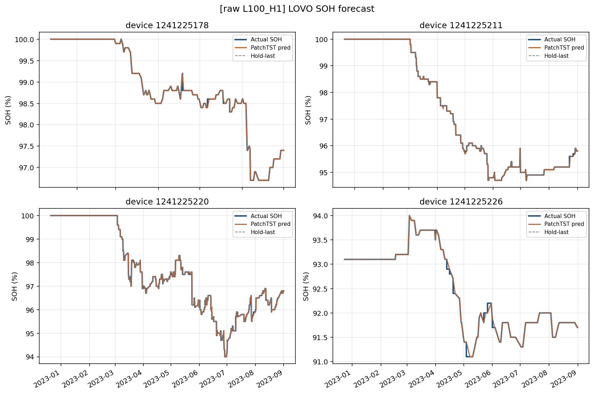

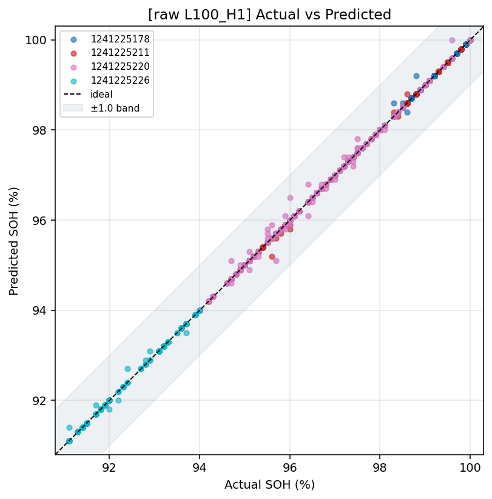

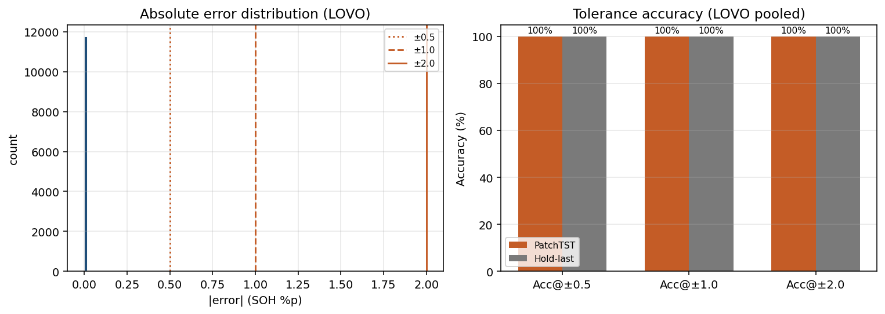

#### 최종 모델 (train)

| 항목 | Acc@±0.5 | Acc@±1.0 | Acc@±2.0 | MAE |
|------|----------|----------|----------|-----|
| model | 100% | 100% | 100% | 0.0009 |
| hold-last | 100% | 100% | 100% | 0.0009 |

저장: `outputs/raw/runs/stride100_L100_H1/models/ev_L100_H1_patchtst.{pt,json}`

---

### R6 — raw · L=100 · H=50 (50스텝 후 SOH)

R5와 동일 궤적(`row_stride=100`), **예측 지평만 H=50**으로 확장.

```bash
python scripts/run_raw.py train --L 100 --H 50 --win-step 5
# plot (선택)
python scripts/run_raw.py plot  --L 100 --H 50 --win-step 5
```

| 항목 | 값 |
|------|-----|
| 궤적 | 59484행 (R5와 동일) |
| 윈도우 | **11780개**, shape `(11780, 100, 17)` |
| 설정 | lookback 100스텝 → **50스텝 후** SOH |

#### LOVO

| test device | n | Acc@±0.5 | Acc@±1.0 | Acc@±2.0 | hold-last Acc@±1.0 | Acc@±1.0 margin |
|-------------|---|----------|----------|----------|--------------------|-----------------|
| 1241225178 | 2671 | 99.0% | 99.7% | 100% | 99.7% | 0.0%p |
| 1241225211 | 4549 | 99.4% | 100% | 100% | 100% | 0.0%p |
| 1241225220 | 4168 | 97.2% | 99.6% | 100% | 99.6% | 0.0%p |
| 1241225226 | 392 | 91.1% | 100% | 100% | 100% | 0.0%p |
| **평균** | — | **96.6%** | **99.8%** | **100%** | **99.8%** | **0.0%p** |

#### 최종 모델 (train)

| 항목 | Acc@±0.5 | Acc@±1.0 | Acc@±2.0 | MAE |
|------|----------|----------|----------|-----|
| model | 98.3% | 99.7% | 100% | 0.048 |
| hold-last | 98.5% | 99.8% | 100% | 0.048 |

- H=1(R5)과 거의 동일 — 50스텝 뒤에도 SOH 변화가 작아 hold-last와 동률
- 상세: `outputs/raw/runs/stride100_L100_H50/models/lovo_metrics.csv`

---

### R7 — raw · L=100 · H=180 (180스텝 후 SOH)

```bash
python scripts/run_raw.py train --L 100 --H 180 --win-step 5
# plot (선택)
python scripts/run_raw.py plot  --L 100 --H 180 --win-step 5
```

| 항목 | 값 |
|------|-----|
| 궤적 | 59484행 (R5와 동일) |
| 윈도우 | **11676개**, shape `(11676, 100, 17)` |
| 설정 | lookback 100스텝 → **180스텝 후** SOH |

#### LOVO

| test device | n | Acc@±0.5 | Acc@±1.0 | Acc@±2.0 | hold-last Acc@±1.0 | Acc@±1.0 margin |
|-------------|---|----------|----------|----------|--------------------|-----------------|
| 1241225178 | 2645 | 95.2% | 99.9% | 100% | 99.0% | +0.9%p ✓ |
| 1241225211 | 4523 | 97.0% | 100% | 100% | 100% | 0.0%p |
| 1241225220 | 4142 | 88.4% | 98.0% | 100% | 98.4% | −0.4%p ✗ |
| 1241225226 | 366 | 65.3% | 87.7% | 100% | 88.8% | −1.1%p ✗ |
| **평균** | — | **86.5%** | **96.4%** | **100%** | **96.6%** | **−0.2%p** |

#### 그래프

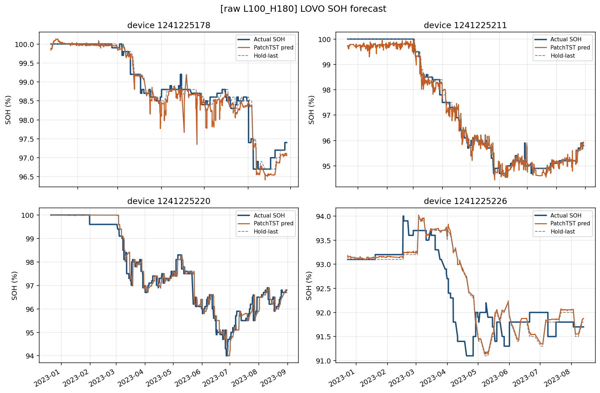

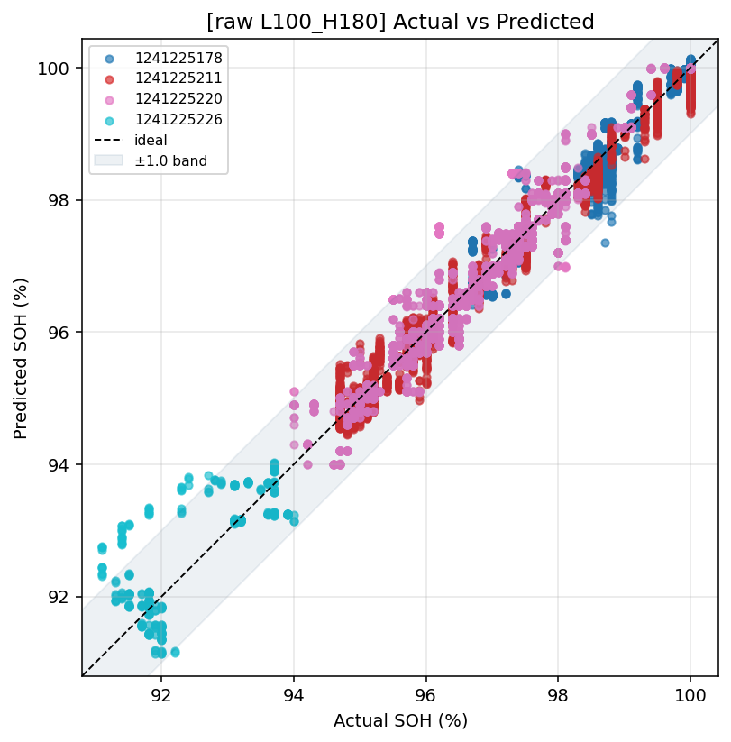

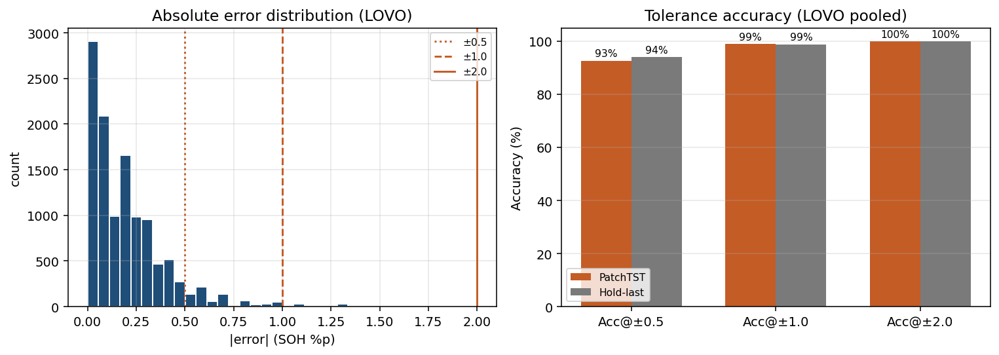

#### 최종 모델 (train)

| 항목 | Acc@±0.5 | Acc@±1.0 | Acc@±2.0 | MAE |
|------|----------|----------|----------|-----|
| model | 94.5% | 98.7% | 100% | 0.133 |
| hold-last | 94.0% | 98.9% | 100% | 0.141 |

#### raw H sweep 요약 (R5–R7)

| H | LOVO Acc@±1.0 | hold-last | 해석 |
|---|---------------|-----------|------|
| 1 | 100% | 100% | 인접 샘플 — 과제 너무 쉬움 |
| 50 | 99.8% | 99.8% | 여전히 hold-last와 동률 |
| 180 | 96.4% | 96.6% | Acc는 소폭 하락, hold-last와 거의 동률 (MAE는 hl이 약간 유리) |

- H를 키워도 **daily R3(85.3%, 7일 후)** 수준의 “어려운” 과제가 되지는 않음
- `row_stride=100` 샘플에서 SOH는 여전히 천천히 변함 → **시간 기준 리샘플** 또는 **H를 더 키우는** 실험이 필요
- 상세: `outputs/raw/runs/stride100_L100_H180/models/lovo_metrics.csv`

---

### R8 — raw · L=120 · H=180 · row_stride=60 (더 촘촘한 샘플)

R7보다 **샘플 간격을 줄이고**(`row_stride=60`), lookback을 **L=120**으로 늘린 설정.

```bash
python scripts/run_raw.py prepare --row-stride 60
python scripts/run_raw.py train   --L 120 --H 180 --win-step 5
python scripts/run_raw.py plot    --L 120 --H 180 --win-step 5
# 또는
python scripts/run_raw.py all --L 120 --H 180 --win-step 5 --row-stride 60
```

| 항목 | 값 |
|------|-----|
| 궤적 | **99139행** (`row_stride=60`) |
| 윈도우 | **19589개**, shape `(19589, 120, 17)` |
| 설정 | lookback 120스텝 → **180스텝 후** SOH, `win_step=5` |

`win_step` 가이드: `row_stride`를 줄이면 윈도우 수가 늘어남 → **5**(R5–R7과 동일, 권장) 또는 학습 속도 우선 시 **10**.

#### LOVO

| test device | n | Acc@±0.5 | Acc@±1.0 | Acc@±2.0 | hold-last Acc@±1.0 | Acc@±1.0 margin |
|-------------|---|----------|----------|----------|--------------------|-----------------|
| 1241225178 | 4441 | 98.2% | 99.3% | 100% | 99.3% | 0.0%p |
| 1241225211 | 7571 | 98.9% | 100% | 100% | 100% | 0.0%p |
| 1241225220 | 6935 | 94.2% | 98.8% | 100% | 99.1% | −0.3%p ✗ |
| 1241225226 | 642 | 74.5% | 96.1% | 100% | 97.8% | −1.7%p ✗ |
| **평균** | — | **91.5%** | **98.5%** | **100%** | **99.0%** | **−0.5%p** |

#### 그래프

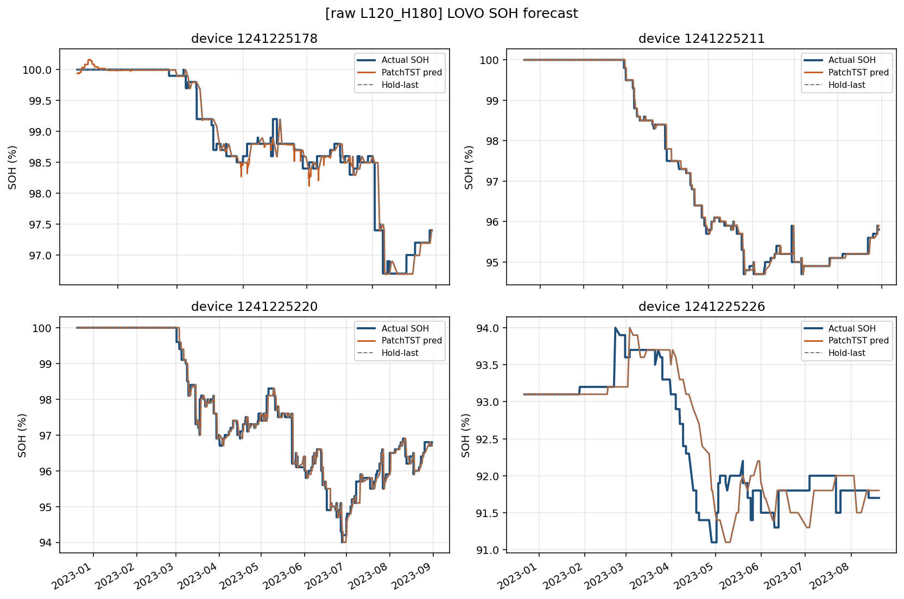

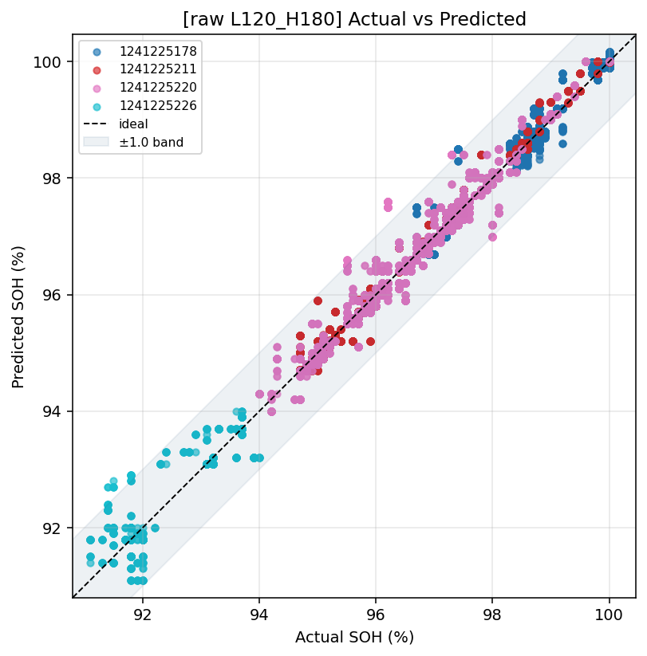

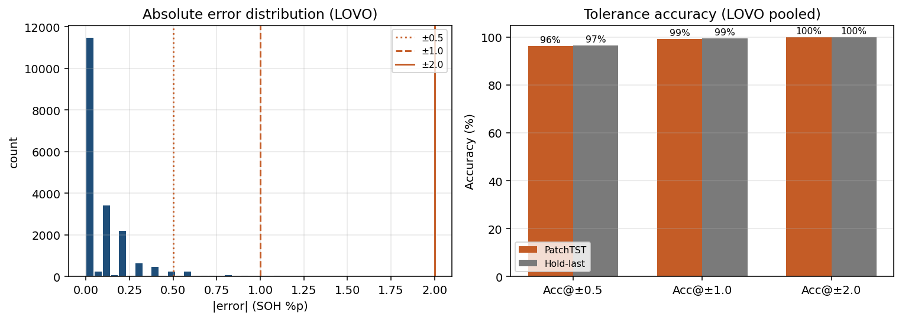

#### 최종 모델 (train)

| 항목 | Acc@±0.5 | Acc@±1.0 | Acc@±2.0 | MAE |
|------|----------|----------|----------|-----|
| model | 96.0% | 99.3% | 100% | 0.095 |
| hold-last | 96.6% | 99.4% | 100% | 0.094 |

#### R8 vs R7

| 항목 | R7 | R8 |
|------|----|----|
| row_stride | 100 | **60** |
| L | 100 | **120** |
| 궤적 행 수 | 59,484 | **99,139** |
| 윈도우 | 11,676 | **19,589** |
| LOVO Acc@±1.0 | 96.4% | **98.5%** |
| hold-last Acc@±1.0 | 96.6% | **99.0%** |

- 샘플을 촘촘히 하고 L을 늘리면 Acc는 오르지만, **hold-last도 같이 올라** 모델 우위는 거의 없음
- 상세: `outputs/raw/runs/stride60_L120_H180/models/lovo_metrics.csv`

---

### R9 — raw · L=120 · H=300 · row_stride=60

R8과 동일 궤적·설정에서 **예측 지평만 H=300**으로 확장.

```bash
python scripts/run_raw.py prepare --row-stride 60
python scripts/run_raw.py train   --L 120 --H 300 --win-step 5
python scripts/run_raw.py plot    --L 120 --H 300 --win-step 5
```

| 항목 | 값 |
|------|-----|
| 궤적 | **99139행** (R8과 동일, `row_stride=60`) |
| 윈도우 | **19493개**, shape `(19493, 120, 17)` |
| 설정 | lookback 120스텝 → **300스텝 후** SOH |

#### LOVO

| test device | n | Acc@±0.5 | Acc@±1.0 | Acc@±2.0 | hold-last Acc@±1.0 | Acc@±1.0 margin |
|-------------|---|----------|----------|----------|--------------------|-----------------|
| 1241225178 | 4417 | 96.0% | 99.0% | 100% | 99.0% | 0.0%p |
| 1241225211 | 7547 | 96.0% | 99.9% | 100% | 100% | −0.1%p ✗ |
| 1241225220 | 6911 | 88.9% | 98.2% | 100% | 98.4% | −0.1%p ✗ |
| 1241225226 | 618 | 66.8% | 86.4% | 100% | 88.8% | −2.4%p ✗ |
| **평균** | — | **86.9%** | **95.9%** | **100%** | **96.6%** | **−0.7%p** |

#### 그래프

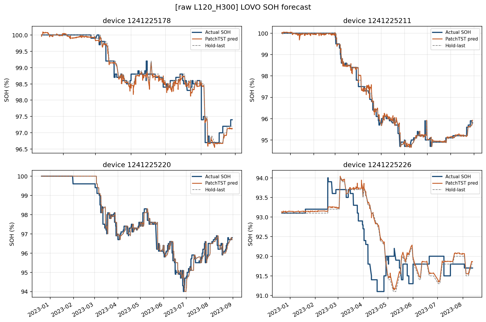

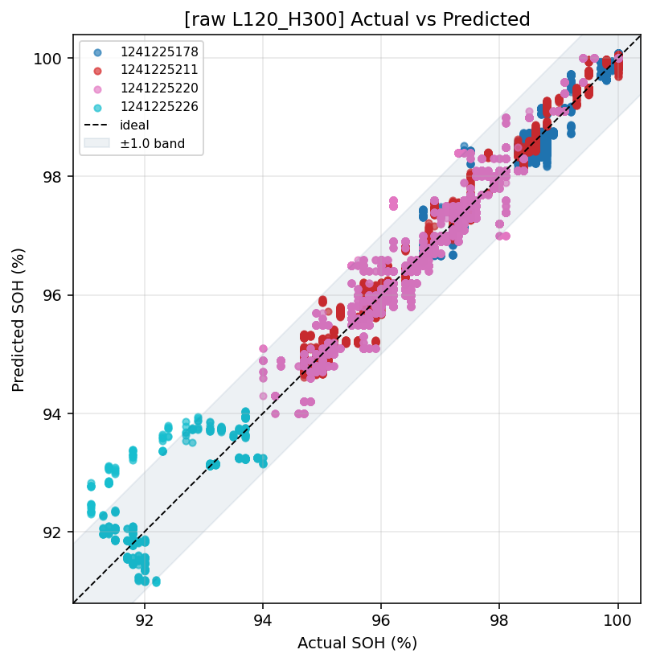

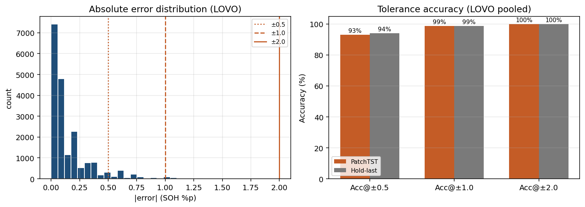

#### 최종 모델 (train)

| 항목 | Acc@±0.5 | Acc@±1.0 | Acc@±2.0 | MAE |
|------|----------|----------|----------|-----|
| model | 94.3% | 98.8% | 100% | 0.135 |
| hold-last | 94.0% | 98.9% | 100% | 0.141 |

#### R9 vs R8 (H sweep, stride 60)

| H | LOVO Acc@±1.0 | hold-last | 평균 MAE (model) |
|---|---------------|-----------|------------------|
| 180 (R8) | 98.5% | 99.0% | 0.095 |
| **300 (R9)** | **95.9%** | **96.6%** | **0.135** |

- H를 180→300으로 늘리면 Acc는 하락하고, **hold-last가 여전히 비슷하거나 약간 유리**
- daily R3(7일 후, 85.3%)보다는 Acc가 높지만, **모델이 baseline을 이기지 못함**
- 상세: `outputs/raw/runs/stride60_L120_H300/models/lovo_metrics.csv`

---

### R10 — raw · L=180 · H=600 · row_stride=30

샘플을 더 촘촘히(`row_stride=30`) 하고 lookback·지평을 함께 키운 설정.

```bash
python scripts/run_raw.py all --L 180 --H 600 --win-step 5 --row-stride 30 --verbose
# 또는 단계별
python scripts/run_raw.py prepare --row-stride 30
python scripts/run_raw.py train   --L 180 --H 600 --win-step 5 --row-stride 30
python scripts/run_raw.py plot    --L 180 --H 600 --win-step 5 --row-stride 30
```

| 항목 | 값 |
|------|-----|
| 궤적 | **198274행** (`row_stride=30`) |
| 윈도우 | **39033개**, shape `(39033, 180, 17)` |
| 설정 | lookback 180스텝 → **600스텝 후** SOH |

#### LOVO

| test device | n | Acc@±0.5 | Acc@±1.0 | Acc@±2.0 | hold-last Acc@±1.0 | Acc@±1.0 margin |
|-------------|---|----------|----------|----------|--------------------|-----------------|
| 1241225178 | 8846 | 95.2% | 100.0% | 100% | 99.0% | +1.0%p ✓ |
| 1241225211 | 15105 | 97.2% | 100.0% | 100% | 100% | −0.0%p ✗ |
| 1241225220 | 13834 | 89.2% | 98.3% | 100% | 98.4% | −0.1%p ✗ |
| 1241225226 | 1248 | 66.5% | 87.4% | 100% | 88.8% | −1.4%p ✗ |
| **평균** | — | **87.0%** | **96.4%** | **100%** | **96.5%** | **−0.1%p** |

#### 그래프

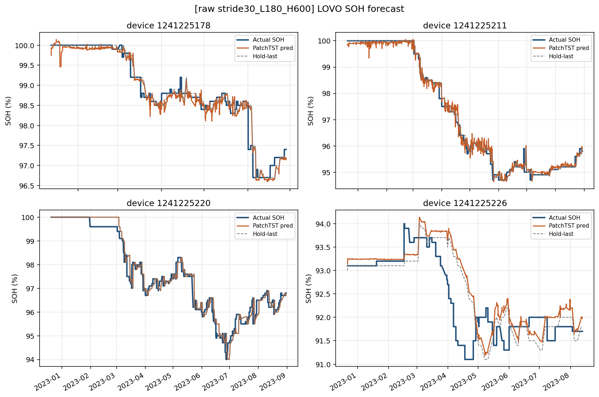

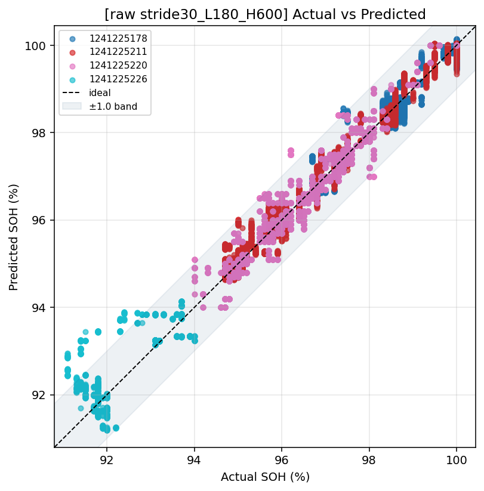

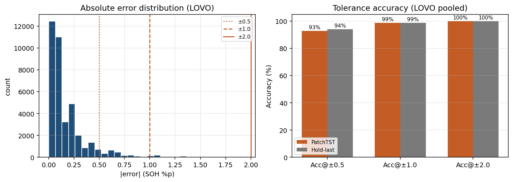

#### 최종 모델 (train)

| 항목 | Acc@±0.5 | Acc@±1.0 | Acc@±2.0 | MAE |
|------|----------|----------|----------|-----|
| model | 95.4% | 98.9% | 100% | 0.114 |
| hold-last | 94.0% | 98.8% | 100% | 0.141 |

#### R10 vs R8 / R9 (raw H·stride sweep)

| ID | row_stride | L | H | 윈도우 | LOVO Acc@±1.0 | hold-last |
|----|------------|---|---|--------|---------------|-----------|
| R8 | 60 | 120 | 180 | 19589 | 98.5% | 99.0% |
| R9 | 60 | 120 | 300 | 19493 | 95.9% | 96.6% |
| **R10** | **30** | **180** | **600** | **39033** | **96.4%** | **96.5%** |

- stride를 30으로 줄이고 L·H를 키우면 윈도우가 약 2배로 늘고, LOVO Acc@±1.0은 R9와 비슷
- 차량 1대(5178)에서는 모델이 hold-last를 **+1.0%p** 이기지만, 평균·나머지 차량에서는 여전히 baseline과 비슷하거나 약간 뒤짐
- train 전체 세트에서는 Acc/MAE가 hold-last보다 소폭 유리 (in-sample)
- 상세: `outputs/raw/runs/stride30_L180_H600/models/lovo_metrics.csv`

---

<!--
### R11 — (다음 실험 템플릿)

```bash
# daily — 한 번에
python scripts/run_daily.py all --exp <exp> --L <L> --H <H>
# raw — 한 번에
python scripts/run_raw.py all --L <L> --H <H> --win-step 5 --row-stride 100
```
-->

---

## 산출물 요약

| 경로 | 내용 |
|------|------|
| `outputs/daily/traj/` · `runs/` | 일별 압축 실험 |
| `outputs/by_chg_mode/{slow,fast}/` | 일별 압축 + 급속/완속 |
| `outputs/raw/traj/` · `runs/stride{S}_.../` | 로우 비압축 실험 (`meta.json`에 `row_stride`) |
| `outputs/<exp>/runs/.../models/` | 가중치·json·`lovo_metrics.csv` |
| `outputs/<exp>/runs/.../figs/` | LOVO 그래프·예측 csv |

---

## 개선 여지

- raw: `row_stride` 줄이기, 시간 간격 고정 리샘플, H 추가 sweep
- hold-last를 이기는 설정만 배포하는 게이트
- 차량 수 확대
